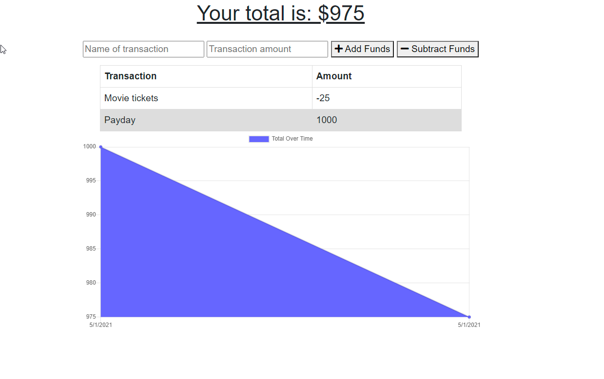
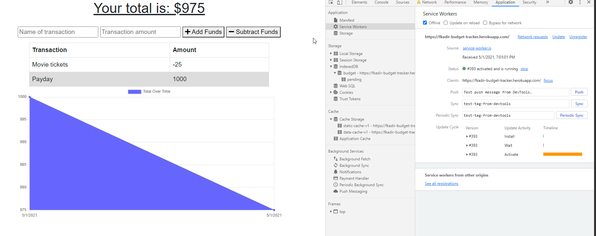

# Budget_Tracker


## Table of Contents

[Description](#Description)  

[User Story](#User_Story)  

[Mock Ups](#Mock_Ups)

[Live Deployment](#Live_Deployment)  

[Installation Instructions](#Installation_Instructions)  

[Questions](#Questions)  


## Description

I created this application to allow a user to track their withdrawals and deposits, even while offline. A user can create a new workout, then add exercises that they completed to the workout. It can also display the statistics of the workouts.

## User_Story
```
AS AN avid traveller I WANT to be able to track my withdrawals and deposits with or without a data/internet connection SO THAT my account balance is accurate when I am traveling
```

# Mock_Ups






## Live_Deployment

[Fitness_Tracker](https://fkadir-fitness-tracker.herokuapp.com/)


## Installation_Instructions
```
In order to run this application you'll need to install the following:

    -Node.js
    -MongoDb Atlas
    -Express
    -Morgan
    -Mongoose
    -Heroku 
```


## Questions

For any questions please reach out to me on [GitHub](https://github.com/FarisKadir).